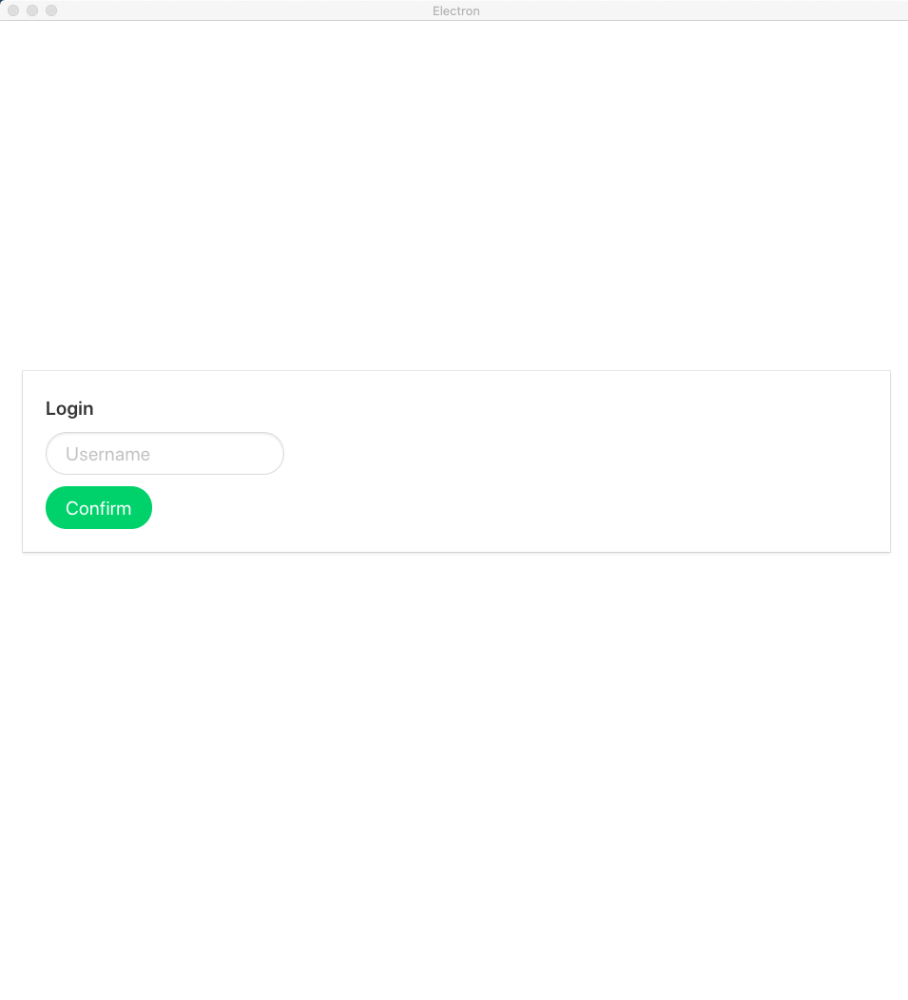
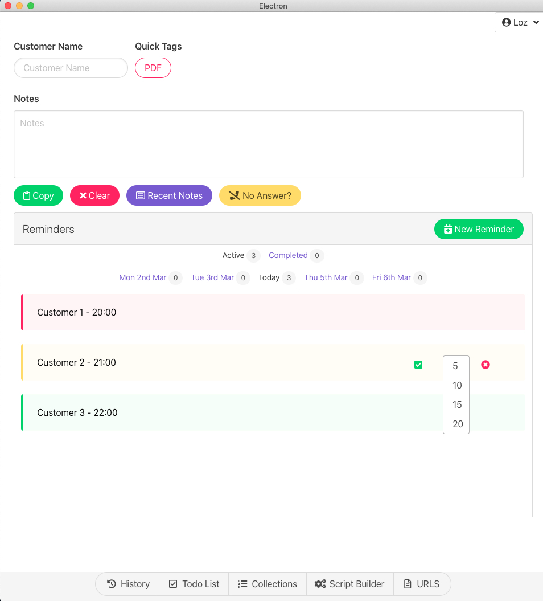
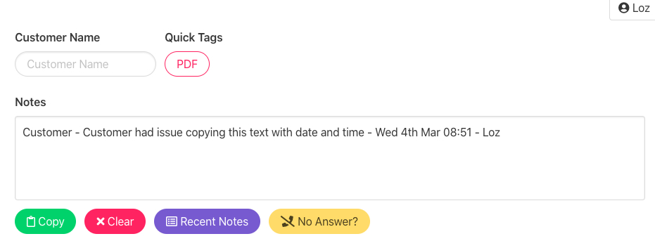

## Project Name Electron-Note-Vue2

# Xilium





Xilium is a simple to use application that enables a support person (first, second, third) to generate notes that all follow a similar syntax EG:

```js
<customer name> - <notes> - <time/date> - <user>
```
### Example:


If all support people are following a similar syntax it makes it simple to read and easier to locate who supported and helped them on which date/time. However, Xilium does more than just create notes it has other tools that enable the support person to track reminders, create a list of todos and create a collection of customer to assign to an outstanding issue.
